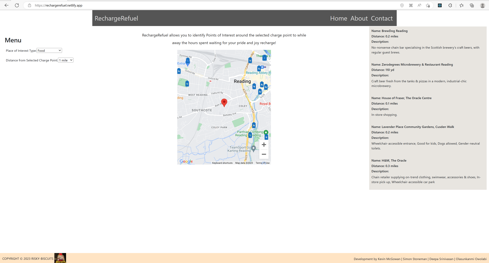
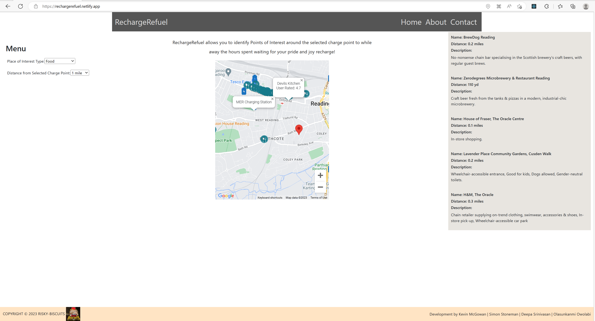
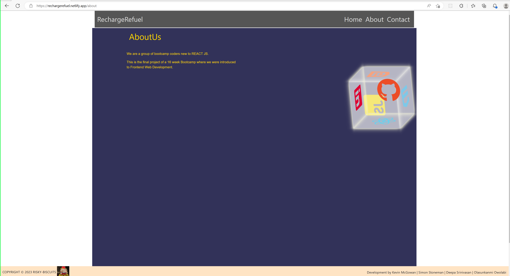
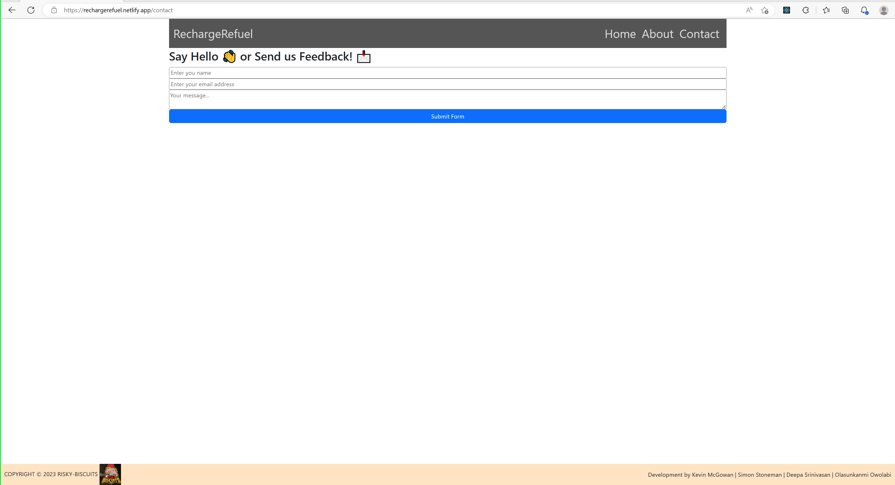
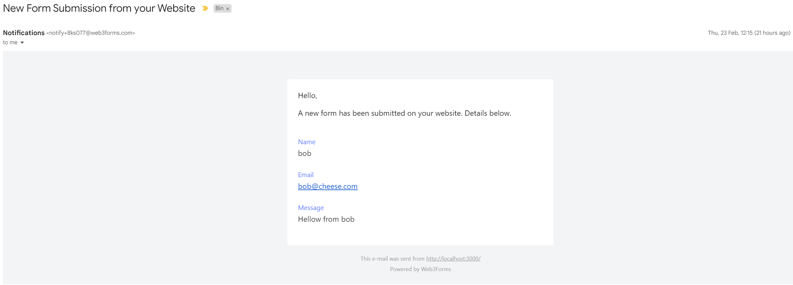

# RechargeRefuel

## The Repository

The objective of this project is to create a react based SOA website that can be used to highlight restaurants around a selected chargepoint that the user is at, from third party apis. 

### User Story

```
AS A user
I WANT to be able to search for restaurants near my chargepoint
SO THAT I can find the a restaurant to eat at via its description and user rating
```

## Features

### Map located at users location based on device information

<br />

<div align="center">
  
</div>

<br />

### Electric Vehicle charge points are automatically loaded around user location
    - User can select a charge point and a infomation is displayed
    - Upon selection also, restaurants within this location are displayed

<br />

<div align="center">
  
</div>

<br />

### About page

<br />

<div align="center">
  
</div>

<br />

### Contacts page using web3forms API

<br />

<div align="center">
  
</div>

<br/>

<div align="center">
  
</div>

<br />

<br />

## Website Link

* https://rechargerefuel.netlify.app/


## Feedback

- Please file an issue at [https://github.com/SimonStoneman/EV-Charge-Point/#issue](https://github.com/SimonStoneman/EV-Charge-Point/#issue).

---

## Copyright

© 2023 RechargeRefuel. All Rights Reserved.

Licensed under the [MIT](LICENSE) license.
